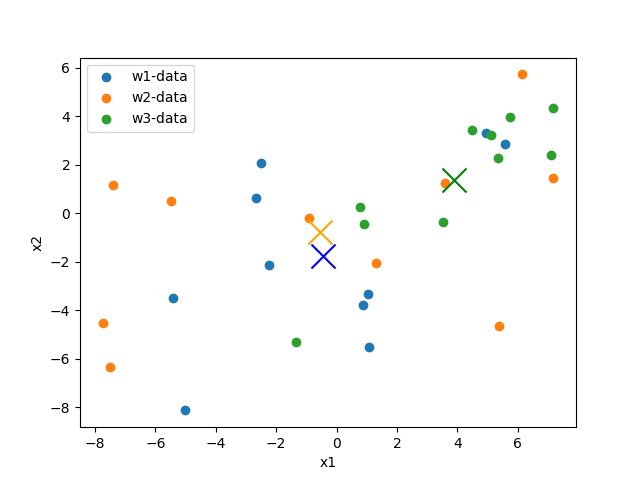
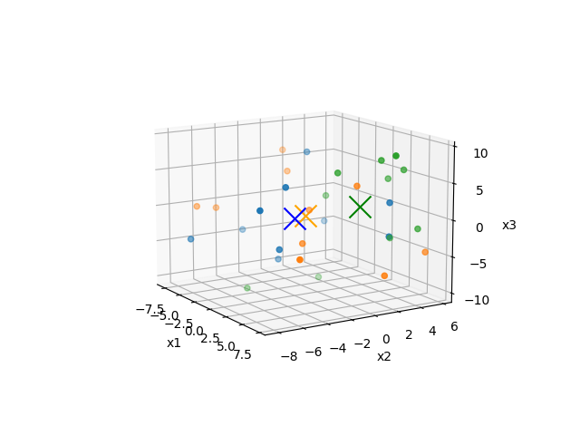

# Intro
This is Bayes Class Exercise.

By: Leo Carten on 10/02/26
# Question 1
1. Interpret the script to identify the format for `samples.mat`.  Describe how this file is setup.  Setup your matrix of the data from page 79 so as to be in the same format as the above script.

`samples.mat` has 3 classes and each class has 3 feature inputs. Each row is a sample. See the variables `w1`, `w2`, and `w3` below:

```
w1=[[-5.01 -8.12 -3.68]
 [-5.43 -3.48 -3.54]
 [ 1.08 -5.52  1.66]
 [ 0.86 -3.78 -4.11]
 [-2.67  0.63  7.39]
 [ 4.94  3.29  2.08]
 [-2.51  2.09 -2.59]
 [-2.25 -2.13 -6.94]
 [ 5.56  2.86 -2.26]
 [ 1.03 -3.33  4.33]]

w2=[[-0.91 -0.18 -0.05]
 [ 1.3  -2.06 -3.53]
 [-7.75 -4.54 -0.95]
 [-5.47  0.5   3.92]
 [ 6.14  5.72 -4.85]
 [ 3.6   1.26  4.36]
 [ 5.37 -4.63 -3.65]
 [ 7.18  1.46 -6.66]
 [-7.39  1.17  6.3 ]
 [-7.5  -6.32 -0.31]]

w3=[[ 5.35  2.26  8.13]
 [ 5.12  3.22 -2.66]
 [-1.34 -5.31 -9.87]
 [ 4.48  3.42  5.19]
 [ 7.11  2.39  9.21]
 [ 7.17  4.33 -0.98]
 [ 5.75  3.97  6.65]
 [ 0.77  0.27  2.41]
 [ 0.9  -0.43 -8.71]
 [ 3.52 -0.36  6.43]]
```
# Question 2
2. Plot clusters `w1`. `w2`, and `w3` using `x1` and x2 in 2-D space. Identify the mean of each cluster and plot a large x, of the appropriate color, at that location. On the plot, draw a rough estimate of where the decision boundaries should be. Include an image of that cluster here.

So, in order to do this, I will be treating `x1` as the x coordinate and `x2` as the y coordinate.

I will also need to know what a decision boundary is: a decision boundary is a line that seperates classes.

See graph below:
```
w1_mean=[x=-0.43999999999999984, y=-1.749]
w2_mean=[x=-0.543, y=-0.7620000000000001]
w3_mean=[x=3.8830000000000005, y=1.3760000000000001]
```

# Question 3
3. Plot clusters `w1`, `w2`, and `w3` using `x1`, `x2` and `x3` in 3-D space.  Identify the mean of each cluster and plot a large x, of the appropriate color, at that location.  Include an image of that cluster here.

This is basically the same as number 2 above except we will be displaying all 3 inputs in 3 dimensional space. 

**Means:**
```
w1_mean=[x=-0.43999999999999984, y=-1.749, z=-0.7660000000000002]
w2_mean=[x=-0.543, y=-0.7620000000000001, z=-0.5419999999999998]
w3_mean=[x=3.8830000000000005, y=1.3760000000000001, z=1.5800000000000005]
```
**Graph:**

# Question 4
4. Type in the script listed above and save it as a m.file with a unique name.  Run the file and debug any issues.

I chose to do this assignment in Python. there are 0 errors with the source code i have written.
# Question 5
5. Go through each line of the code and, in conjunction with reviewing the content from chapter 2 in the text, comment each line to describe it purpose and cite specific equations in the text as necessary.

So, I am not going to comment each line line-by-line, but I will give an overview of what the matlab source code is doing as that is more reasonable:

- First, the samples are loaded. The data is structured very similiar to how i have `w1`, `w2`, and `w3` formatted in Question 1.
- Second, the source caluclates the mean and covariance for each class using `for` loops.
- Third, the source introduces some new data in the form of variable `s`.
- Fourth, based the data points in `s`, the source calculates the Mahalanobis distance from each class. Remember, the Mahalanobis distance takes into account the means and covariance of each class and then produces a number that dictates how far away the data point is from the mean of the clas.
- Fifth, the source defines some prior probabilities for us to take into consideration.
- Sixth, using the prior probilities from above, the source uses the equation for discrimate functions and assigns a score for each. then, the source determines which class to assign the data point to based on the score.
# Question 6
6. Run the script and interpret the results.  Describe what each output signifies and indicates about the data.  Draw connections to the cluster plots in task 2 and 3.

Since i am doing this in Python, i will explain what the MatLab source code is doing in terms of the results:

- The source is using a formula to determine which class each data point in `s` belongs to based on the discriminant score.
- Rememnber, discrimant scores take into consideration things like the mean and covariance matrix so it understands where the spread of data points is centered around and how the features interact with eachother.
- You assign the class based on the highest discriminant score. For example, if the scores were -10 and -6, you'd assign the data point to the class that corresponds to the score of -6 since its larger than -10.
- To tie this into task 2 and 3: basically, each data point in `s` should be assigned to the class that its closest to scattering of data in relation to that classes mean. for example, the second data point in `s` is `[5,3,2]`. Based on looking at the graphs i created for task 2 and 3, the score for `w3` should be the highest for data point `[5,3,2]`, therefore this data point should be assigned to class `w3`.
# Question 7
7. Convert the script into a function that can take in a matrix with any amount of states of nature, features, or samples and perform the same calculations.  Note that the above script is hard codded to represent the specified problem.  You will have to apply additional inputs into the function to allow for a user to input these values and remove the hard codded content.

I will provide pseudocode WITH COMMENTS to demonstrate my understanding instead of rewriting the entire script. First however, lets point out whats hardcoded and how we intend to generalize the funciton:

| Hardcoded value in MatLab / Python source  | Generalized for function |
| -------- | ------- |
| 3 classes   | dont hardcode 3 specific classes (w1,w2,w3) |
| 3 features | dont hardcode 3 specific features (x1,x2,x3)   |
| 10 samples  | dont only have 10 samples, instead allow the user to input all samples  |
| 4 test points in variable `s` | Instead, just allow the user to input all new data points |
| specific priors in `pw` in MatLab source | Instead, just allow user to input prior probabilities | 

Next, lets write pseudocode for how to convert hardcoded values to generalized functions that still allows us to do things like the MatLab code does, such as determine Mahalanobis distance and generate discrimant scores:

```py
samples = getUserInput(samples) # get user input for the samples -> this replaces the hardcoded self.samples variable above
s = getUserInput(newDataPoints) # get user input for new data points -> this replaces the hardcoded variable s in the MatLab source code
pw = getUserInput(priorProbs) # get user input for prior probabilities
expectedColumns # number of columns in samples per class
userInputDataPoints # number of columns in s per class
if expectedColumns != userInputDataPoints:
    raise ValueError("The columns and classes provided in samples does not match s") # make sure the data provided by the user is valid (e.g., if samples has 3 classes with 5 features per class but the user provides an array input with 20 features, we will need to throw an error)

Mahalanobis = []

# iterate over each data point in s and determine its Mahalanobis distance for each class in samples
for index, point in enumerate(s):
    print(f"Index={index}, point={point}") # show the user that we are iterating over s
    for c in classes:
        mahalanobis_distance = getMahalanobisDistance(point, c) # get the Mahalanobis Distance of each point compared to each class. This function will do all the heavy lifting math associated with Mahalanobis distance
        Mahalanobis.append(mahalanobis_distance) 
        print(f"The Mahalanobis distance from point={point} to class={c} is {mahalanobis_distance}")

# iterate over each data point in s and determine its discrimiant score for each class. then inform the user which class the data point belongs to.
for index, point in enumerate(s):
    score = negative_infinity
    classDataPointBelongsTo = null
    for c in classes:
        currentScore = getDiscriminantScore(point, c, pw) # get the score for each data point in relation to each class and prior probabilities. This function will do all the heavy lifting math associated with disriminant scores
        if currentScore > score:
            # the data point belongs to this class so far, update the score and class variable
            score = currentScore 
            classDataPointBelongsTo = c
    print(f"The data point {point} has the highest score of {score} and belongs to class {classDataPointBelongsTo}")
```